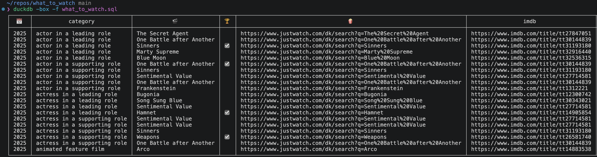

# what to watch

Can't decide what to watch? Explore oscar nominees across categories and years to get inspired.

Example:

## prerequisites

requires duckdb (`brew install duckdb`)

# files / how to run

- oscars.csv: sourced from [here](https://github.com/DLu/oscar_data)
- ingest.sql: run with `duckdb -f ingest.sql`
  - change first line of file to your iso-country code to see what is available in your region
- nominations.parquet: generated by command above
- what_to_watch.sql: run with `duckdb -box -f what_to_watch.sql`
- movie_comments.csv: Your comments about what you've watched, or if a movie is unavailable for streaming in your region
  - use last column from what_to_watch.sql to add new rows to this sheet
